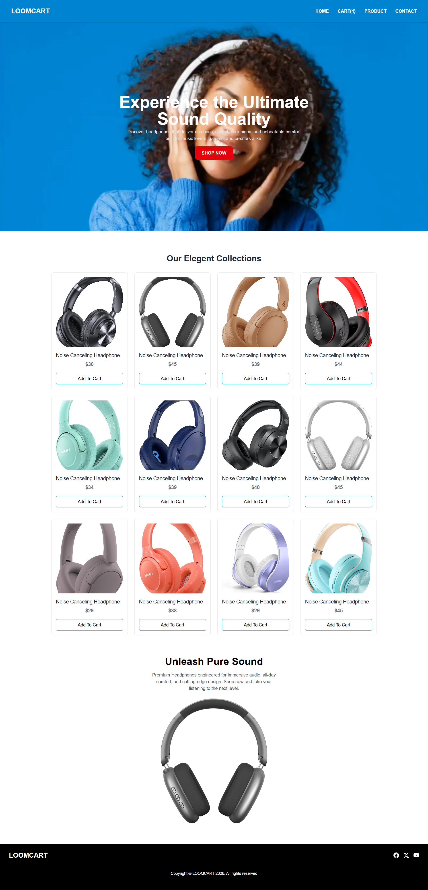
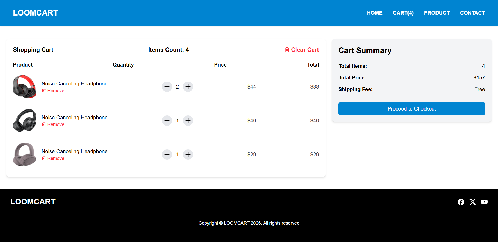

# 🛒 Loomcart — Headphone E-Commerce UI


**Loomcart** is a frontend e-commerce application focused on showcasing a headphone shopping experience with a dedicated cart section.  
🌐 **Live Demo:** https://ar-loomcart.vercel.app/  
🛒 **Cart Page:** https://ar-loomcart.vercel.app/cart  

---

## Project Purpose

This project was built to **improve my Tailwind CSS skills** and strengthen my understanding of **building e-commerce user interfaces**, while also enhancing my **React.js and JavaScript knowledge** through hands-on implementation.

The focus is entirely on **frontend development**, UI structure, component design, and user interaction flow.

---

## Preview

**Home / Product Listing Page**  


**Cart Page**  


---

## Features & Highlights

- **Product Browsing UI** – Displays headphone products with images, titles, and pricing  
- **Cart Section** – A dedicated `/cart` route to view selected products  
- **Interactive Components** – Add and remove items with frontend state handling  
- **Tailwind CSS Styling** – Utility-first CSS used for layout, spacing, and responsiveness  
- **Clean & Modern UI** – Simple and intuitive shopping experience  

---

## Responsiveness

This web application is **fully responsive**, providing a smooth and consistent user experience across mobile devices, tablets, and desktops.

---

## Tech Stack

- **React.js** – Component-based UI development  
- **JavaScript (ES6+)** – Application logic and interactivity  
- **Tailwind CSS** – Utility-first styling framework  
- **Vite** – Fast development and build tooling  
- **Vercel** – Hosting and deployment  

---

## Project Structure

Loomcart-Headphone.Ecommerce/

├── public/ # Static assets

├── src/ # React source code

│ ├── components/ # Reusable UI components

│ ├── pages/ # Pages (Home, Cart)

│ ├── App.jsx # App configuration

│ └── main.jsx # Entry point

├── package.json # Dependencies

├── vite.config.js # Vite configuration

└── README.md # Documentation


---

## Run Locally

1. **Clone the repository**
   ```bash
   git clone https://github.com/Rahumansgit/Loomcart-Headphone.Ecommerce.git

2. **Install dependencies**
   ```bash
   cd Loomcart-Headphone.Ecommerce

   npm install


3. **Start the development server**
   ```bash
   npm run dev

# **Future Improvements**

- Backend integration with APIs
- User authentication and profiles
- Cart persistence and checkout flow
- Product filtering and search
- State management using Context API / Redux
